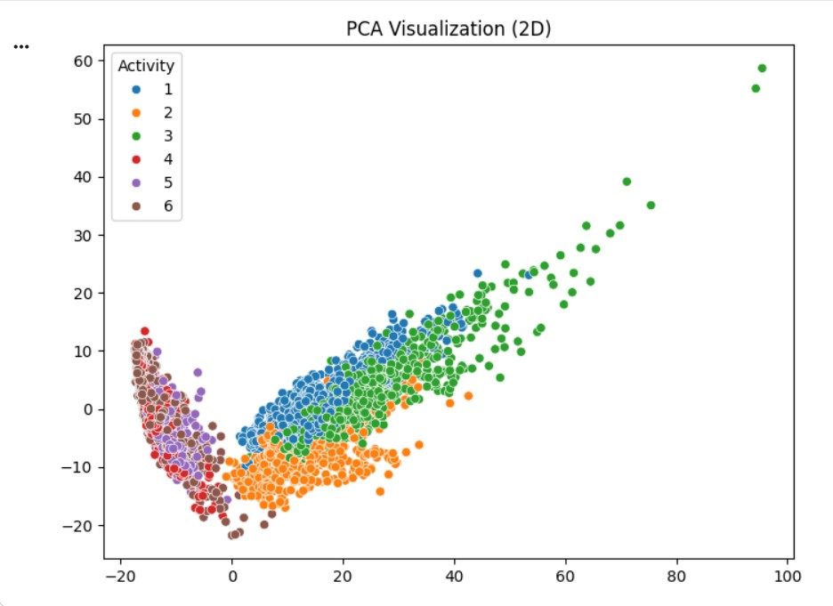
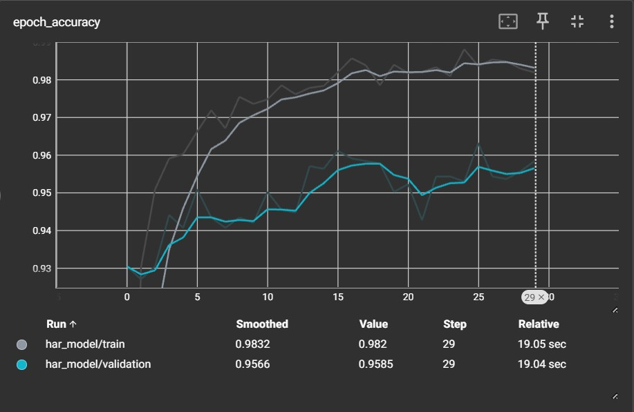
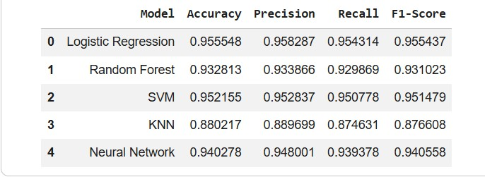

# HARUS-Project

🧠 Human Activity Recognition using Machine Learning & TensorFlow

📌 Project Overview
This project builds an end-to-end Human Activity Recognition (HAR) system using smartphone sensor data. It classifies human activities such as walking, sitting, and standing using both classical machine learning models and a deep learning neural network.

The project demonstrates how well-engineered features can enable traditional models to perform competitively with deep learning approaches.

🎯 Problem Statement
Automatically identifying human activities using smartphone sensors is crucial for applications like:
Healthcare monitoring
Fitness tracking
Smart environments
Rehabilitation systems
This project solves the problem by training models on sensor-derived features to accurately classify activities.

📊 Dataset
Dataset: UCI Human Activity Recognition Using Smartphones
Total Samples: 10,299
Features: 561 engineered features
Classes: 6 activities

Activities:
Walking
Walking Upstairs
Walking Downstairs
Sitting
Standing
Laying
⚙️ Tech Stack
Python
Pandas, NumPy
Scikit-learn
TensorFlow / Keras
Matplotlib, Seaborn
TensorBoard

🔄 Project Workflow

(Data Loading → EDA → Preprocessing → Model Training → Evaluation → Comparison)

Key Steps:
Loaded and cleaned dataset from text files
Performed Exploratory Data Analysis (EDA)
Applied feature scaling using StandardScaler
Trained multiple ML models
Built a Neural Network with TensorFlow
Evaluated using accuracy, precision, recall, F1-score
Visualized results using TensorBoard

🤖 Models Implemented
Machine Learning Models:
Logistic Regression
Random Forest
Support Vector Machine (SVM)
K-Nearest Neighbors (KNN)
Deep Learning:
Fully Connected Neural Network
Batch Normalization
Dropout
Softmax Output

📈 Results
Model	Accuracy
Logistic Regression	95.55%
SVM	95.21%
Neural Network	94.03%
Random Forest	93.28%
KNN	88.02%

📊 Visualizations

### PCA Visualization

The PCA visualization shows clear clustering of activities, indicating that the dataset is highly separable.

---

### Training vs Validation Accuracy

The model shows stable convergence with training accuracy reaching ~98% and validation accuracy ~95.6%, indicating good generalization.

---

### Model Comparison

Logistic Regression and SVM outperform other models, showing that classical approaches work effectively on engineered features.

📊 Key Insights
Classical models (LR, SVM) performed slightly better than deep learning.
The dataset contains engineered time and frequency domain features, reducing the need for complex neural architectures.
High feature quality leads to strong model performance.

📉 Error Analysis
Minor misclassifications occur between similar activities such as:

Walking Upstairs vs Walking Downstairs
Sitting vs Standing

Overall error rate remains very low due to high-quality features.

📌 TensorBoard Visualization
Training vs Validation Accuracy
Loss Curves
Model Graph
Weight Distributions

🚀 How to Run
1. Clone Repository
git clone <your-repo-link>
cd <repo-name>
2. Install Dependencies
pip install -r requirements.txt
3. Run Notebook

Open the .ipynb file in Google Colab or Jupyter Notebook.

📁 Project Structure
├── data/
├── notebook.ipynb
├── README.md
├── requirements.txt
🎯 Conclusion

This project shows that well-engineered features can outperform complex models, and classical machine learning remains highly effective for structured datasets.

🔗 Future Improvements
Use raw sensor signals instead of engineered features
Apply CNN/LSTM for time-series modeling
Real-time activity recognition system
Deploy as a mobile or web application

👨‍💻 Author
Devesh Chauhan
